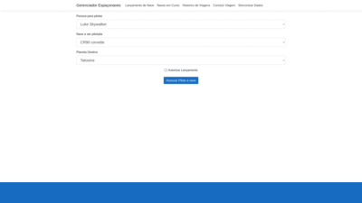
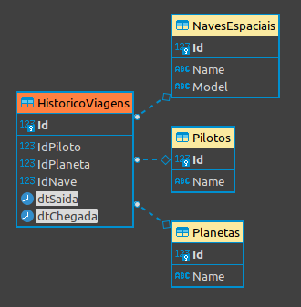
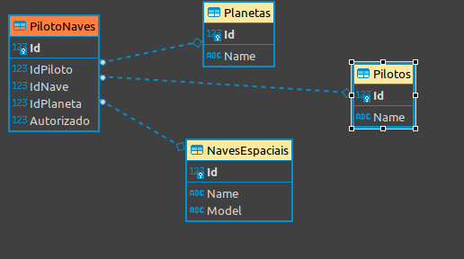

# Gerenciador de Espaço naves Star Wars - DIO
### Projeto de conclusão referente ao curso: Criando um gerenciador de espaçonaves do star wars com SQL Server + .NET com o professor **Thiago Campos de Oliveira**.

## Tópico 1 - Funcionalidades

Criei baseado na arquitetura MVC Dotnet. 

## Relações entre Tabelas

- Relações da Tabela **HistoricoViagens**

- Relações da Tabela **PilotoNaves**
